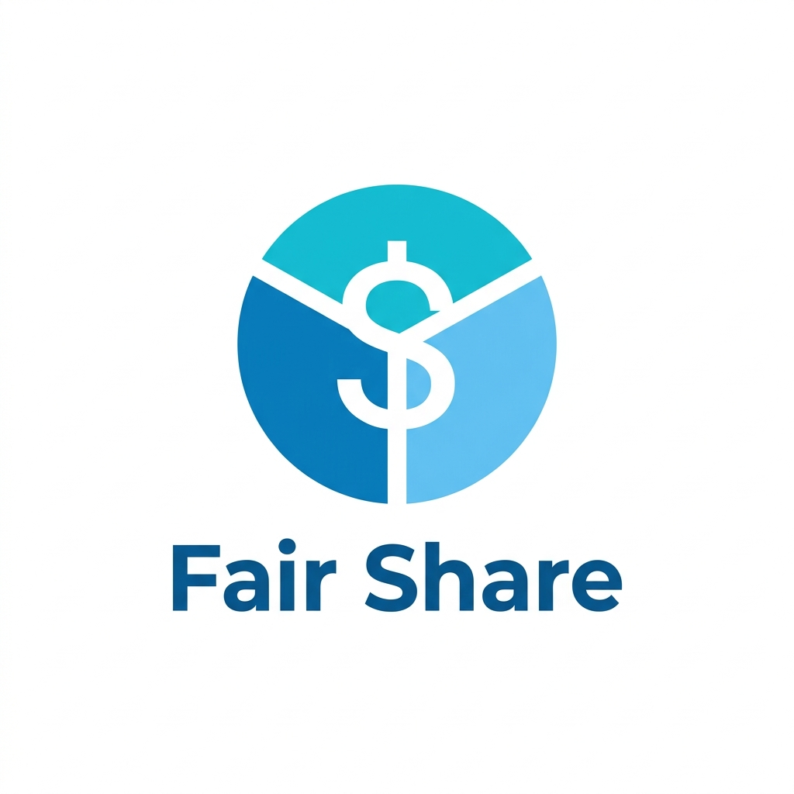

  
  <h1>Fair Share</h1>
  
<em>A Group Expense Management System</em>

## 📖 About The Project
**Fair Share** is a database-driven web application designed to simplify group expenses. Built for our DBMS Mini-Project, it tracks who paid for what, splits bills equally, and calculates exact outstanding balances using an automated, trigger-maintained cache in MySQL.

### 👨‍💻 Team Members
*   **Aditya Agarwal** (UID: 2025300002)
*   **Advait Ambarkar** (UID: 2025300003)
*   **Arnav Badhe** (UID: 2025300011)

## 🛠️ Tech Stack
*   **Database:** MySQL (3NF Normalized, Trigger-Maintained Caching)
*   **Backend:** Python 3, FastAPI
*   **Frontend:** HTML5, Bootstrap 5, Jinja2 Templates
*   **Analytics:** Chart.js

## ⚙️ Setup Instructions
1. Clone the repository.
2. Install dependencies: `pip install -r requirements.txt`
3. Execute the `schema.sql` script in MySQL to construct the tables and triggers.
4. Start the local server: `uvicorn main:app --reload`
