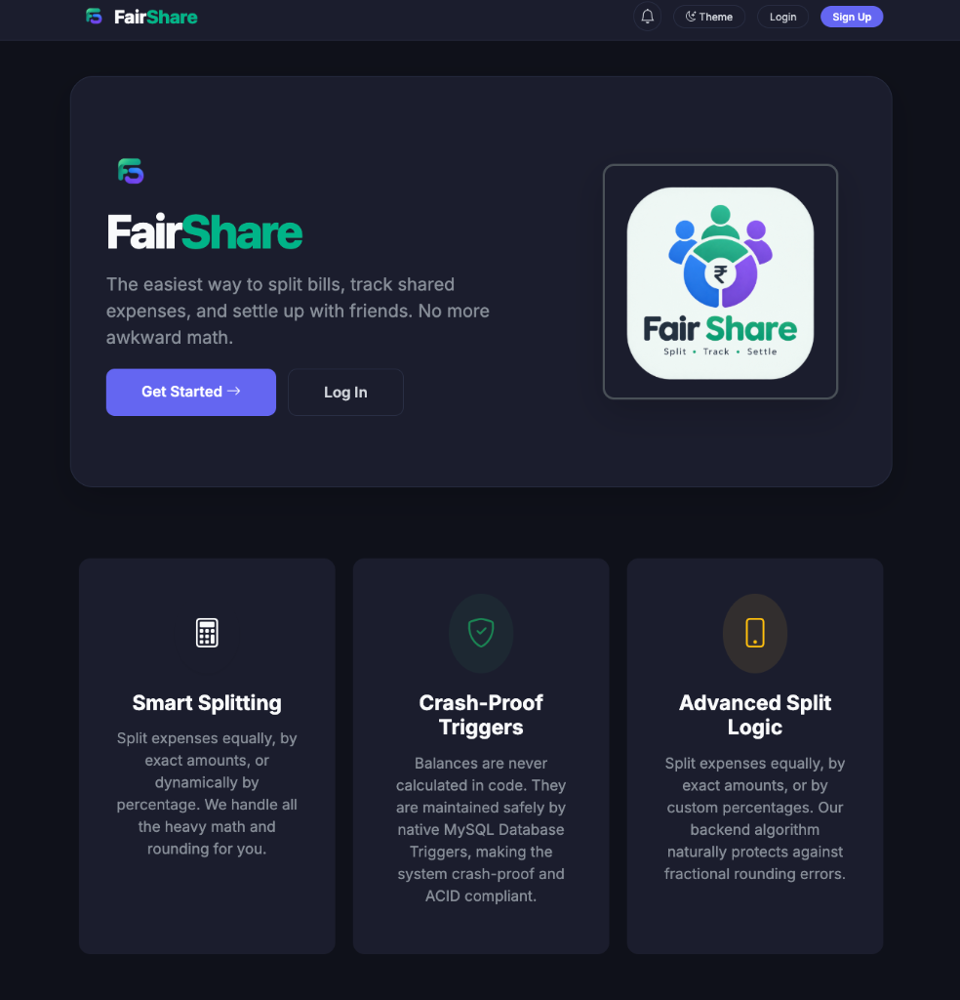
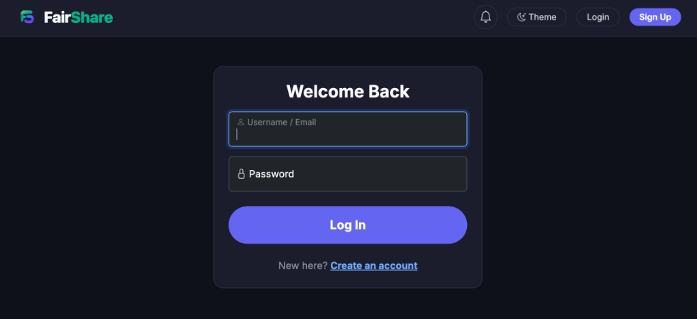
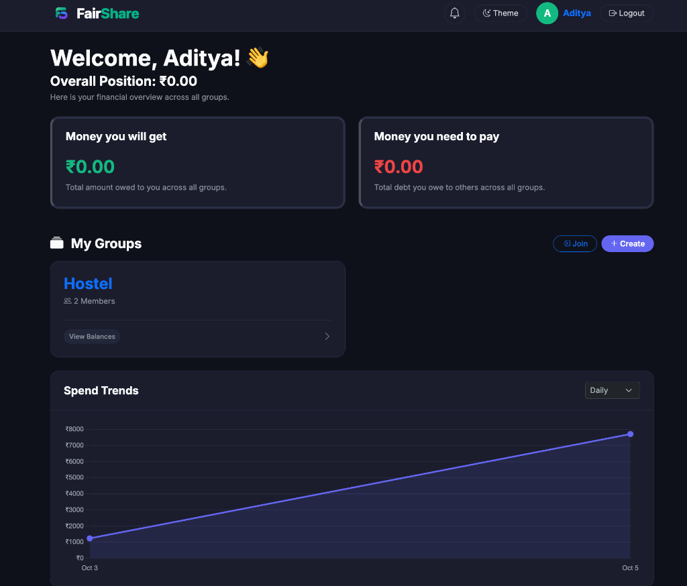
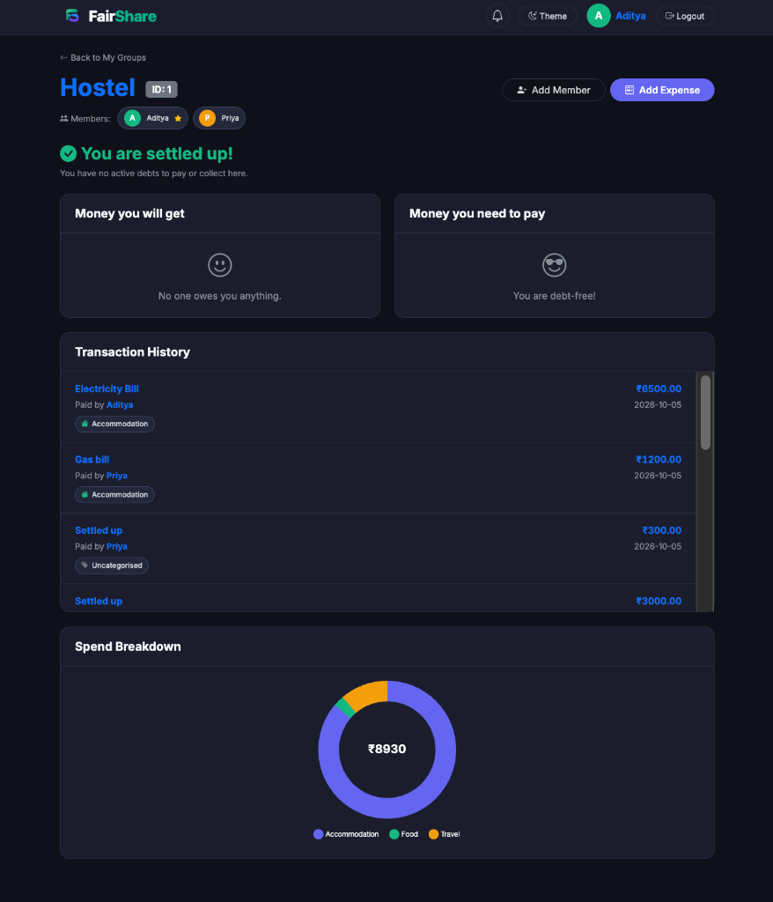
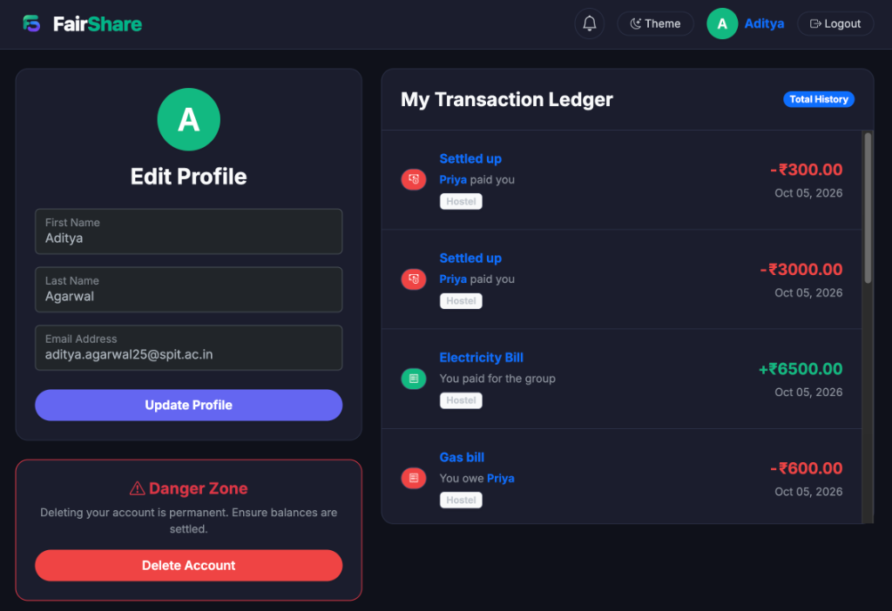

# 💸 Fair Share

**🌐 Live Deployment Link:** [https://fair-share-lga4.onrender.com/](https://fair-share-lga4.onrender.com/)


**A lightning-fast, Splitwise-style group expense tracker built for real-time settlements.**


---

## 📖 Problem Statement
Managing shared expenses among friends, roommates, college groups, or other communities can become complicated when several people contribute different amounts toward common expenses. In a typical group, expenses such as groceries, rent, travel, food, subscriptions, or utility bills may be paid by different individuals and shared among different combinations of members. Keeping track of these transactions manually through notes, spreadsheets, or messaging applications can result in calculation errors, missing records, and confusion about who owes whom and how much.

The problem becomes more complex when a group has multiple expenses over a period of time. For example, if Gopal pays ₹900 for dinner shared by three members, Virat pays ₹600 for groceries shared by two members, and Rohit later repays Gopal, simply recording the transactions is not sufficient. The system must maintain the individual share of every expense, identify the person who initially paid, calculate the outstanding amount for each member, and keep track of subsequent repayments. Without a structured system, it becomes difficult to maintain an accurate and consistent record of these financial relationships.

Another challenge is that users may belong to multiple groups simultaneously. A person may be part of a college trip group, a roommate group, and a group of friends, each having completely different expenses and members. Therefore, the system must ensure that expenses and settlements remain associated with the correct group and participants. It should also prevent duplicate or inconsistent records and provide a reliable way to retrieve historical transactions.

Our project addresses this problem by designing a relational Group Expense Management System, inspired by the core functionality of applications such as Splitwise. The primary objective is to use DBMS concepts to efficiently store, relate, and process information about users, groups, expenses, individual expense shares, payments, and reminders.

## 💡 Proposed Solution
The proposed system provides a centralized database through which users can create or participate in groups and record their shared expenses. The database is structured around interconnected entities such as Users, Groups, Expenses, Expense Splits, Payments, and Reminders. A separate group-membership relationship allows a user to participate in multiple groups while maintaining the members associated with each group.

When an expense is added, the system records important information such as the total amount, description, group, and user who paid the expense. The expense is then divided among the relevant members and it shows exact amount owed by each participant. This allows the system to determine individual liabilities instead of simply storing the total expense.

The system also maintains Payments/Settlements, allowing users to record when one member pays another member back. For example, if Bob owes Alice ₹300 and subsequently pays her ₹300, the payment is stored as a separate transaction. This provides a complete history of both expenses and repayments. The Reminders component allows one user to remind another about an outstanding amount, providing an additional mechanism for managing pending payments.

The relational structure provides several advantages. Data consistency and integrity are maintained through primary keys, foreign keys, composite keys, and appropriate relationships between tables. The design also reduces unnecessary data duplication by separating users, groups, expenses, and transactions into logically independent tables. M:N relationships such as users joining multiple groups and users participating in multiple expense splits are handled through junction tables.

The database can further support SQL queries to generate useful information such as total expenses of a group, individual contributions, outstanding balances, payment history, group membership, and users with pending amounts. This makes the project more than a simple expense-recording application; it demonstrates practical applications of relational database concepts such as normalization, entity relationships, joins, aggregation, and transaction management. The system is designed with industry-level data integrity using primary and foreign key constraints, validation rules, and database triggers. Automated triggers handle critical updates and validations in real time, reducing manual intervention, maintaining consistency across related tables, and enabling efficient transaction management in real-world scenarios.

## 🗂️ ER Diagram
You can view the full Entity-Relationship Diagram here: **[ER Diagram (PDF)](docs/ER_Diagram.pdf)**

## ✨ Features
* **Authentication:** Secure user signup and login with `bcrypt` password hashing.
* **Groups:** Create groups (e.g., "Goa Trip") and invite friends securely via Group IDs.
* **Join Requests:** Users can request to join groups, which Admins can approve or reject.
* **Expense Splitting:** Add expenses and split them across multiple members simultaneously.
* **Intelligent Debt Netting:** If Bob owes Alice ₹300, and Alice borrows ₹100 from Bob, the database automatically nets it out to Bob owing Alice ₹200.
* **Peer-to-peer Settlements:** Record direct payments to settle active debts.
* **Real-time Notifications:** In-app toast notifications and auto-reloading UI when someone requests to join, adds an expense, or settles a debt.
* **Dark Mode:** Seamless light/dark mode toggle.

## ☁️ Live Demo (Free Tier Notice)
**🌐 Live Deployment Link:** [https://fair-share-lga4.onrender.com/](https://fair-share-lga4.onrender.com/)

This project is currently deployed using free-tier cloud services (Render for the web app, Aiven for MySQL). To conserve resources, these providers automatically power down the server and database after a period of inactivity. 

**If you are reviewing this project and the site takes a few minutes to load, or throws a connection error:** Please do not consider this a bug! It means the cloud services are waking up from cold storage. The owner may need to manually click "Power On" in the database console to restore access.

## 📸 Screenshots
### Landing Page


### Login Page


### Dashboard (Light/Dark Mode)


### Group Details & Balances


### User Profile & Ledger


---

## 🛠️ Tech Stack & Architecture

* **Backend:** `FastAPI` (Python) - Chosen for its incredible speed, asynchronous design, and clean routing structure.
* **Database:** `MySQL` - Chosen for robust ACID compliance, transactions, and powerful native trigger support.
* **Frontend:** `Jinja2` Templates, `Bootstrap 5`, Vanilla JS - Chosen to keep the architecture simple and server-side rendered, eliminating the need for a heavy React/Node compilation pipeline.

### Architecture Flow
1. The **Browser** sends a standard HTTP POST request (e.g., Add Expense).
2. **FastAPI** intercepts it, verifies the session cookie, and wraps the MySQL queries in an ACID Transaction.
3. **MySQL** inserts the data. Deep inside the database, native **Triggers** automatically intercept the insert and recursively update the cache tables.
4. FastAPI commits the transaction and redirects the browser, rendering the new state via **Jinja2**.

---

## 🗄️ Database Design

Please see [docs/DATABASE.md](docs/DATABASE.md) for full table schemas. 

**Key Design Decisions:**
* **The `Balances` Cache Table:** Calculating debts recursively across thousands of transactions is an $O(N)$ operation. We use a cache table (`Balances`) to make dashboard loads $O(1)$.
* **Database Triggers:** To ensure the `Balances` table is never out of sync, we use MySQL Triggers (`after_expense_split_insert`, `after_payment_insert`). They handle the complex mathematics of netting opposite-direction debts precisely at the database layer.
* **ACID Transactions:** When saving an expense, we must insert 1 row into `Expenses` and 3 rows into `Expense_Splits`. If the server crashes mid-way, the database is corrupted. We wrap these in a single SQL Transaction (`conn.commit()` / `conn.rollback()`) to ensure complete atomicity.
* **DECIMAL over FLOAT:** Money is stored as `DECIMAL(10, 2)` to prevent binary floating-point precision errors.

---

## 🚀 Setup Instructions

### 1. Clone the Repository
```bash
git clone https://github.com/yourusername/fair-share.git
cd fair-share
```

### 2. Environment Setup (Mac/Linux)
```bash
python3 -m venv venv
source venv/bin/activate
pip install -r requirements.txt
cp .env.example .env
```

### 2. Environment Setup (Windows)
```cmd
python -m venv venv
venv\Scripts\activate
pip install -r requirements.txt
copy .env.example .env
```

### 3. Database Setup
1. Create a database in MySQL named `FairShare_DB`.
2. Update your `.env` file with your MySQL credentials.
3. Run the SQL files in order inside your MySQL client (or MySQL Workbench):
   - `database/schema.sql`
   - `database/triggers.sql`
   - *(Optional)* `database/demo_data.sql`

### 4. Run the Server
```bash
uvicorn app.main:app --reload
```
Open your browser to `http://127.0.0.1:8000`.

---

## 🧪 Running Automated Tests
We have included a script to aggressively verify that the database triggers are working correctly. It checks for negative balances, self-debts, and opposite-direction debts that failed to net out.
```bash
python tests/test_balances.py
```

---

## ⚠️ Troubleshooting

* **`ModuleNotFoundError: No module named multipart`**: FastAPI requires `python-multipart` to read form data. Run `pip install python-multipart`.
* **Database Connection Errors**: Ensure your MySQL server is actually running, and your `.env` password is correct.
* **`[Errno 98] Address already in use`**: Port 8000 is occupied. Stop other running apps or run `uvicorn app.main:app --port 8001`.

---

## 📈 Known Limitations & Future Improvements
* Currently, expenses can only be split equally or by strict fixed amounts. Future versions should support percentage-based splits.
* The system does not currently export reports to PDF/CSV.

## 🎓 What I Learned
Building this project taught me how to bridge the gap between frontend templates and robust relational databases. I learned how to manage complex many-to-many state, write native database triggers to offload processing from Python, and protect against race conditions using transactions. 

---
**Developed by:** Aditya Agarrwal, Advait Ambarkar, Arnav Badhe
**Institution:** Sardar Patel Institute of Technology (SPIT)  
**License:** [MIT](LICENSE)
